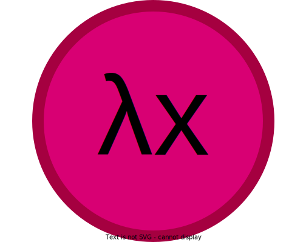

<div align=center>
  <br>
  </img>
  <br>
</div>

# lamb: Lambda calculus and pure function composition

Lamb is a simple library for creating [pure](https://en.wikipedia.org/wiki/Pure_function), composable functions. It implements the two primary operations in [lambda calculus](https://en.wikipedia.org/wiki/Lambda_calculus), namely abstraction and application.

Lamb exports a decorator called `lamb` which implements the abstraction operation. Any two `lamb`-decorated functions can be composed using the `|` operator.

Lamb exports a decorator `lamb` which adds abstraction to a given function. Any two functions decorated by `lamb` can then be composed using the pipe operator. For example: 

```py
from lamb import lamb
```

Create two functions `f` and `g`

f = lamb(lambda x: x ** 2)

g = lamb(lambda x: x + 2)
```

Compose them (abstraction):

```
h = f | g 
```


